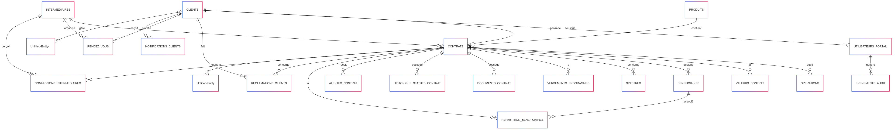

# 📊 Projet Data Analyst – Base de données Assurance Vie  

## 📝 Contexte  
Ce projet modélise une **base de données d’assurance vie** et propose un ensemble d’outils pour :  
- gérer et analyser les contrats, opérations et sinistres,  
- suivre l’évolution des encours et versements,  
- explorer les comportements clients (rachats, réclamations),  
- produire des analyses et visualisations interactives.  

Il combine **SQL** (modélisation, procédures, vues), **Python** (analyses et automatisation), et **Streamlit** (dashboard interactif).  

---

## 🗂️ Organisation du projet  

📁 **Diagramme/**  
- Contient le schéma relationnel de la base sous format Mermaid + PNG.  

📁 **script_sql/**  
- Scripts SQL de création de tables, insertion de données, requêtes analytiques, triggers, procédures, vues.  

📁 **scripts_python/**  
- Scripts Python d’analyse exploratoire et application Streamlit pour dashboard interactif.  

📁 **dashboard_streamlit/**  
- Interface utilisateur développée avec Streamlit (visualisations et indicateurs).  

---

## 🗄️ Modèle de données  

La base couvre les **entités principales d’une assurance vie** :  

| Table                        | Description |
|----------------------------- |-------------|
| `clients`                    | Informations sur les assurés |
| `contrats`                   | Souscriptions d’assurance vie |
| `produits`                   | Types de produits d’assurance vie |
| `operations`                 | Versements, rachats |
| `valeurs_contrat`            | Évolution des encours |
| `beneficiaires`              | Personnes désignées en cas de décès |
| `sinistres`                  | Événements impactant les contrats |
| `reclamations_clients`       | Réclamations et demandes de support |
| `commissions_intermediaires` | Commissions versées aux intermédiaires |
| `intermediaires`             | Agents, courtiers, etc. |  

### 📌 Schéma relationnel  
  

---

## 🛠️ Scripts SQL  

📍 Dossier : [`script_sql/`](./script_sql)  

- `creation_tables.sql` → Création des tables principales.  
- `insert_data.sql` → Insertion des données simulées.  
- `script_select_assurance.sql` → Requêtes analytiques classiques.  
- `script_select_avancé.sql` → Requêtes plus poussées (jointures, agrégations complexes).  
- `script_evenements.sql` → Gestion des événements liés aux contrats.  
- `script_procedure.sql` → Procédures stockées.  
- `script_triggers.sql` → Déclencheurs pour automatiser certaines actions.  
- `script_vues.sql` → Création de vues pour simplifier les analyses.  

📸 *Aperçu des scripts SQL dans le repo*  
  

---

## 🐍 Scripts Python  

📍 Dossier : [`scripts_python/`](./scripts_python)  

- `assurance_vie_analyse.py` → Analyse exploratoire des données.  
- `dashboard_app_assurance.py` → Application **Streamlit** pour visualisation interactive.  

📸 *Aperçu des scripts Python dans le repo*  
  

---

## 📊 Dashboard interactif  

📍 Dossier : [`dashboard_streamlit/`](./dashboard_streamlit)  

- Permet d’explorer les contrats, opérations, sinistres et indicateurs clés.  
- Interface construite avec **Streamlit** (lancement avec `streamlit run dashboard_app_assurance.py`).  

📸 *Aperçu de l’organisation du projet sur GitHub*  
  

---

## 🚀 Exécution du projet  

1️⃣ **Cloner le projet**  
```bash
git clone https://github.com/ouizalou/assurance_vie_project.git
cd assurance_vie_project
